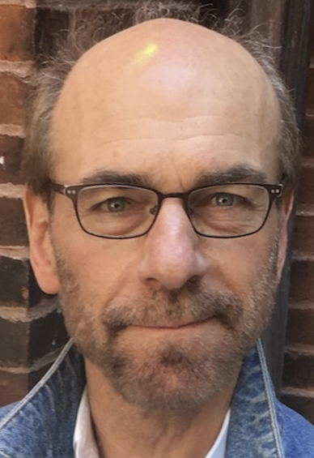
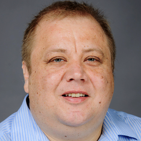
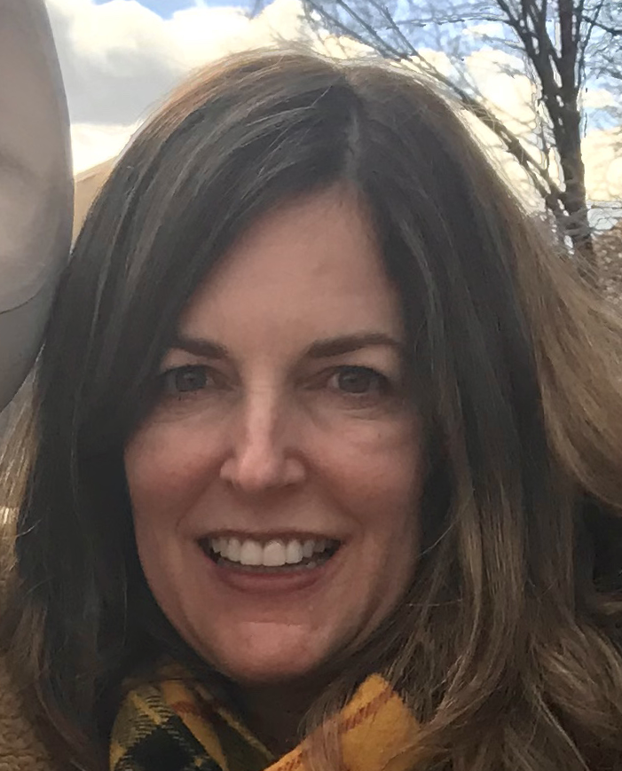

Diana is a product of a collaborations between Brandeis University, Colorado State University, and the University of Florida.

# Faculty

|  |  |  |  |  |  |
|-|-|-|-|-|-|
| 
James Pustejovsky
 | Nikhil Krishnaswamy | Ross Beveridge | Francisco R. Ortega | Lisa Daunhauer | Jaime Ruiz
| 
(Brandeis)
 | (Colorado State) | (Colorado State) | (Colorado State) | (Colorado State) | (Florida)

# Contributing Researchers

